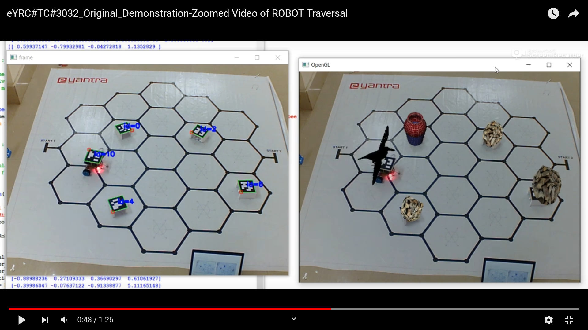

# Line-following-robot
As part of the national-level robotics competition, E-Yantra, organised by IIT Bombay, we built a line following robot inspired from the classic thirsty crow story using the ATMEGA2560 microcontroller to pick pebbles and deposit them into a water pitcher. 

The task is to pick all three magnetic pebbles and deposit them into the water pitcher in the shortest possible. We used the A\* algorithm for calculating the shortest path between the pitcher and the pebbles. In addition, we used augmented reality to project 3D blender models of crow, pebble pile and water pitcher onto the Aruco markers and updates to the pebble pile and water level were made in real-time once the tasks were completed.

## Hardware requirements
- ATMEGA2560 Development Board
- 2 Xbee modules
- L298 Motor Driver
- White Line sensor
- Li-ion Pack Battery (11.1 V, 2200mAH)
- 2 Quadrature Encoder Motors with Shaft attachments
- 2 Wheels
- Electromagnet
- Buzzer module
- Connecting jumper wires

## Software requirements
- ATMEL Studio 6
- Python >= 3.5
- Blender >= 2.79
- OpenCV >= 3.4
- OpenGL >= 3.1

## Demonstration video

Click on the thumbnail below to watch the demonstration video

